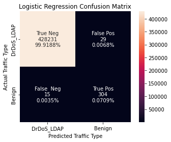

## Mitigating DDoS attacks and ensuring service availability

The goal of this project is to create a model that can correctly identify benign, legitimate from malclious junk traffic in the midst of a DDoS attack. 

As a first step, I created a logistic regression model using all features in the dataset. Parallelizing the fit process using Dask saved considerable time here.

The figure above depicts the confusion matrix for the first-pass logistic regression model.

This result suggests that budget may have a significant positive impact on a film's revenue. However, the magnitude of the model's residuals makes it clear that budget is not the only important factor in determining the success of a film.